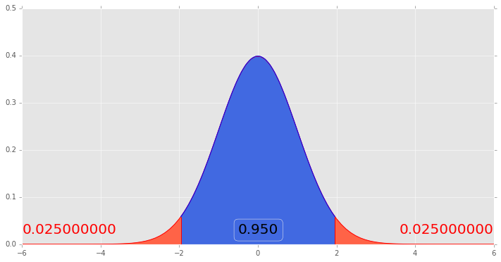

# Kurze Vorstellung von Python und Pandas

## Links
- [Python Notebooks sofort ausprobieren](https://try.jupyter.org/)
- [Anaconda Download](https://www.continuum.io/downloads)
- [Python Dokumentation](https://docs.python.org/3/)
- [Pandas Dokumentation](http://pandas.pydata.org/pandas-docs/stable/)
- [Video: Einführung in Pandas in 10 Minuten](https://vimeo.com/59324550)
- [Buch: Datenanalyse mit Python - Auswertung von Daten mit Pandas, NumPy und IPython](http://www.oreilly.de/catalog/datenanalysemitpythonger/)
- [SciPy](https://www.scipy.org/)
- [SciPy - Getting Started](https://www.scipy.org/getting-started.html)
- [SciPy Dokumentation](https://www.scipy.org/docs.html)
- [SciPy Statistik](https://docs.scipy.org/doc/scipy/reference/tutorial/stats.html)

## Zusätzliche Libraries
conda install pandas-datareader